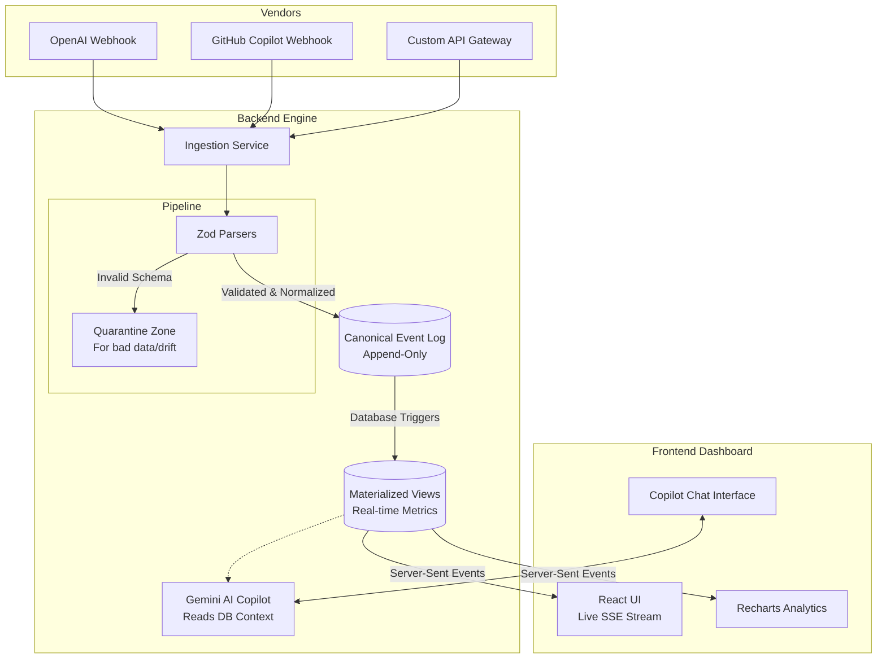

# Eventual AI

## What It Does
Eventual AI is a real-time **FinOps-for-AI observability system**. 
If your company uses multiple AI tools (like OpenAI, GitHub Copilot, Anthropic, etc.), it can be incredibly difficult to track exactly how much money is being spent and who is using what. 

This engine solves that by ingesting raw usage and cost data from various AI vendors and translating it all into a single **Canonical Format**. It provides a stable, unified dashboard for querying spend and token usage, even when vendors send duplicate data, change their data structures without warning, or send costs late.

---

## Tech Stack
- **Frontend**: React, Tailwind CSS (Custom Palette), Recharts, Framer Motion
- **Backend**: Node.js, Fastify, TypeScript
- **Database**: SQLite (using `better-sqlite3` for fast, synchronous append-only logs)
- **Validation**: Zod (for strict schema validation and drift detection)
- **AI Integration**: Google GenAI SDK (Gemini 2.5 Flash) for the conversational Copilot
- **Assets**: `rembg` (Python) for AI-driven background removal of 3D avatars

---

## Key Features

1. **AI-Powered FinOps Copilot**
   A chat interface embedded directly into the dashboard. Powered by Google Gemini, the assistant has real-time, zero-latency access to your live database metrics (total spend, unresolved spend, monthly trends, and app budgets) and can intelligently answer natural language questions about your burn rate.

2. **Real-Time Analytics Dashboard**
   Live charts built with Recharts automatically update as server-sent events (SSE) push new data.
   - **Monthly Spend Summary**: A trend line visualizing costs over time.
   - **Spend Separated by App**: A bar chart dynamically categorizing costs by vendor.
   - **App Usage Breakdown**: A detailed data table.

3. **Production-Ready Webhooks**
   The `/api/webhooks/ingest/:vendor` endpoint safely accepts payloads from various tools. It validates the schema using Zod, drops it into a canonical append-only event log, and materializes the state for querying.

4. **Transparent 3D Avatar**
   The UI utilizes an independent, fully transparent robotic avatar processed via AI background-removal, eliminating messy CSS blends for a flawless, professional look.

---

## Architecture



---

## Future Enhancements
The system is built to be extremely extensible. While currently supporting OpenAI and Copilot as demonstrations, the core architecture allows for **infinite vendor integration**.

In the future, adding support for apps like **Claude (Anthropic), Canva, Adobe, Midjourney**, or any other usage-based API is trivial:
1. A developer simply writes a small `VendorParser` using Zod.
2. The parser translates the vendor's specific usage metrics (e.g., `images_generated` or `claude_tokens`) into our Canonical standard.
3. The app is instantly registered and its costs will appear dynamically on the Analytics Dashboard without any database schema changes.

---

## Getting Started

Everything runs locally with a single command (using SQLite for local testability without Docker dependencies).

```bash
# 1. Provide your Gemini API Key in backend/.env
# GEMINI_API_KEY="your_api_key_here"

# 2. Install dependencies at the root
npm install

# 3. Run the tests (verifies core requirements)
npm run test

# 4. Start the Backend Server and UI Console concurrently
npm start
```
The UI will open at `http://localhost:5173`. You can chat with the AI Copilot and watch live metrics update as webhooks hit the backend!