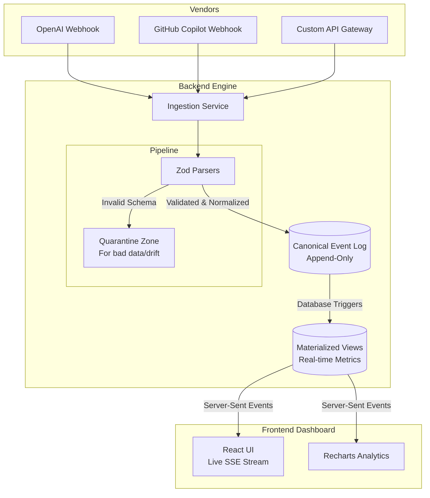

# Eventual AI

## What It Does
Eventual AI is a real-time **FinOps-for-AI observability system**. 
If your company uses multiple AI tools (like OpenAI, GitHub Copilot, Anthropic, etc.), it can be incredibly difficult to track exactly how much money is being spent and who is using what. 

This engine solves that by ingesting raw usage and cost data from various AI vendors and translating it all into a single **Canonical Format**. It provides a stable, unified dashboard for querying spend and token usage, even when vendors send duplicate data, change their data structures without warning, or send costs late.

---

## Tech Stack
- **Frontend**: React, Tailwind CSS (Custom Palette), Recharts, Framer Motion
- **Backend**: Node.js, Fastify, TypeScript
- **Database**: SQLite (using `better-sqlite3` for fast, synchronous append-only logs)
- **Validation**: Zod (for strict schema validation and drift detection)

---

## Architecture



---

## Future Enhancements
The system is built to be extremely extensible. While currently supporting OpenAI and Copilot as demonstrations, the core architecture allows for **infinite vendor integration**.

In the future, adding support for apps like **Claude (Anthropic), Canva, Adobe, Midjourney**, or any other usage-based API is trivial:
1. A developer simply writes a small `VendorParser` using Zod.
2. The parser translates the vendor's specific usage metrics (e.g., `images_generated` or `claude_tokens`) into our Canonical standard.
3. The app is instantly registered and its costs will appear dynamically on the Analytics Dashboard without any database schema changes.

---

## Getting Started

Everything runs locally with a single command (using SQLite for local testability without Docker dependencies).

```bash
# 1. Install dependencies at the root
npm install

# 2. Run the tests (verifies core requirements)
npm run test

# 3. Start the Backend Server and UI Console concurrently
npm start
```
The UI will open at `http://localhost:5173`. You can interact with the system via the Control Panel to inject events, drift, and redeliveries, and watch the system resolve them live over SSE.